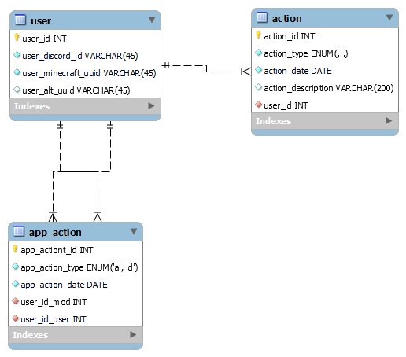

# Overview

This program utilizes a MySQL database to link Discord accounts to Minecraft accounts. It also tracks actions taken against a player (such as a ban, mute, etc) and any applications made by the user that have been processed.

I made this program as a starting point to more easily track information about a player within a specific server.

[Software Demo Video](https://youtu.be/a4YE_BivlDI)

# Relational Database

This project uses a MySQL database that currently has three tables: user, action, and app_action.

# Development Environment

To develop this project I used Visual Studio Code and MySQL Workbench.

This program uses Python and [MySQL Connector](https://pypi.org/project/mysql-connector-python/).

# Useful Websites

{Make a list of websites that you found helpful in this project}
* [w3schools MySQL Connector](http://url.link.goes.here)
* [MySQL Workbench Community download](https://dev.mysql.com/downloads/workbench/)

# Future Work

* Expand database to track more items
* Integrate with Discord bot